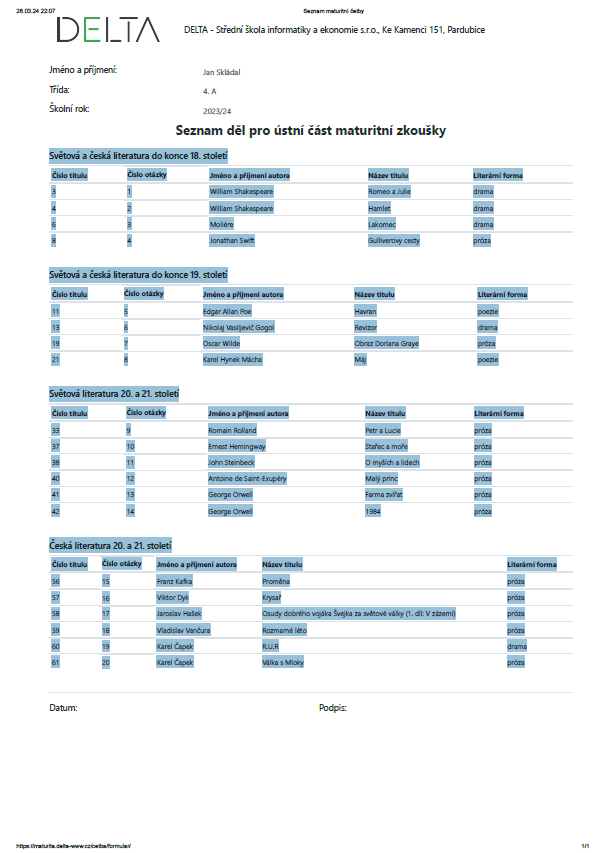

Skript přeformátuje text z vygenerovaného pdf z https://maturita.delta-www.cz/cetba/formular/ do formátu csv (pro jednoduchý import např. do excelu)

Ukázka formátu vtupního textu: `text.txt`

```
Světová a česká literatura do konce 18. století
Číslo titulu
Číslo otázky
Jméno a příjmení autora
Název titulu
Literární forma
3
1
William Shakespeare
Romeo a Julie
drama
4
2
William Shake
etc...
```

Ukázka formátu vtupního textu: `result.csv`

```
Světová a česká literatura do konce 18. století
Číslo titulu,Číslo otázky,Jméno a příjmení autora,Název titulu,Literární forma
3,1,William Shakespeare,Romeo a Julie,drama
4,2,William Shakespeare,Hamlet,drama
6,3,Moliére,Lakomec,drama
8,4,Jonathan Swift,Gulliverovy cesty,próza
etc...
```

---
Očekávaný vstup získáte okopírováním obsahové části pdf 

příklad:



a nahrazením v `text.txt` souboru

následně spustíte skript `split.py`